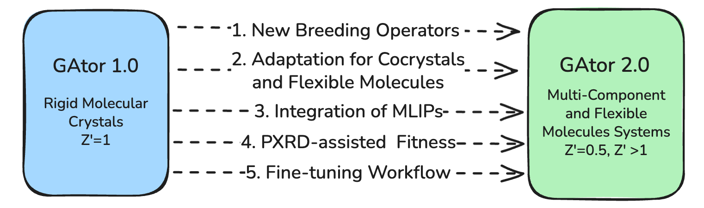
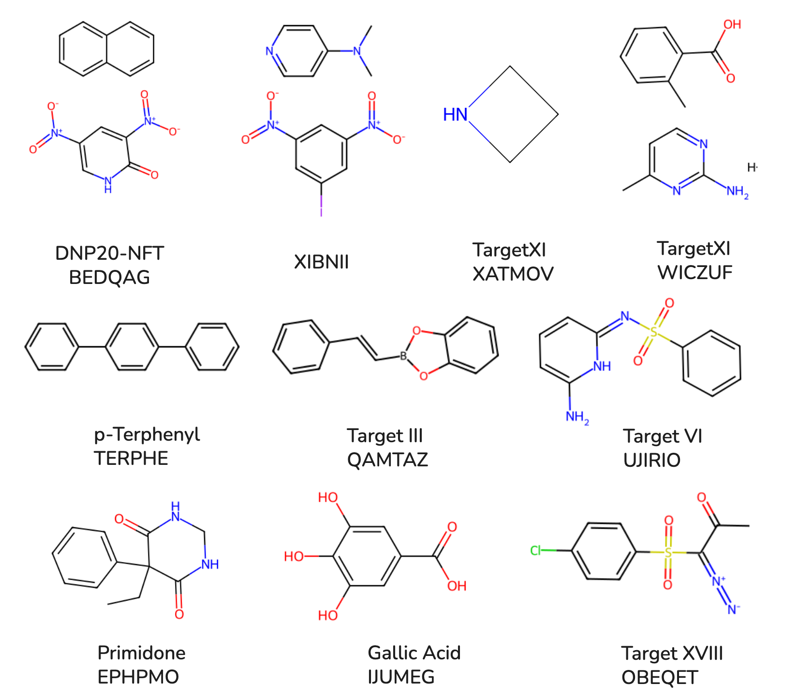

# GAtor

**A First-Principles Genetic Algorithm for Molecular Crystal Structure Prediction**

  

---

## What is GAtor?

GAtor is an open-source genetic algorithm (GA) for predicting the crystal structures of organic molecules. Given a molecular geometry as input, GAtor searches for the most stable packing arrangements in the solid state — a fundamental challenge in computational chemistry and materials science.

  

<em>GAtor 2.0 has been validated on a wide range of molecular crystal systems.</em>

### Key Features

- **Machine-learned interatomic potentials (MLIPs)** — Native support for UMA, MACE, and AIMNet2 for fast GPU-accelerated energy evaluations (~30 min for 300 generations)
- **DFT backends** — Full support for FHI-aims and VASP for high-accuracy calculations
- **Multi-objective optimization** — Optimize energy, powder X-ray diffraction (PXRD) similarity, or combined fitness functions using the VC-PWDF metric
- **Cocrystal & Z' > 1 support** — Predict multi-component crystals and structures with multiple molecules in the asymmetric unit
- **Flexible molecules** — Conformer-aware crossover and mutation operators for molecules with torsional degrees of freedom
- **Adaptive selection** — Tournament selection with adaptive sizing, roulette wheel, and adaptive mixed strategies
- **Symmetry-aware crossover** — Preserves crystallographic symmetry during crossover operations
- **Hierarchical mutation** — 45+ mutation operators organized by category (translation, rotation, strain, block, conformer)
- **Clustering & duplicate detection** — Affinity propagation clustering with RCD or RSF feature vectors
- **Scalable parallelism** — Asynchronous parallel GA with `srun` or `mpirun` on HPC clusters
- **PXRD fine-tuning** — Post-GA local refinement of structures against experimental PXRD patterns

### How It Works

  

1. **Initial Pool** — Generate or load an initial set of crystal structures (via [Genarris](https://github.com/Yi5817/Genarris), CIF files, or other sources)
2. **Fitness Evaluation** — Compute fitness scores (energy, PXRD similarity, or combined)
3. **Selection** — Choose parent structures based on fitness (adaptive tournament, roulette, etc.)
4. **Genetic Operators** — Apply crossover and mutation to create offspring structures
5. **Structure Check** — Validate interatomic distances and cell geometry using the specific radius proportion (SR)
6. **Geometry Optimization** — Relax and compute energy using MLIP or DFT
7. **Duplicate Detection** — Check for duplicates against the existing pool
8. **Pool Update** — Add unique, valid structures; update fitness scores and clustering

The GA loop repeats until the desired number of structures have been added or convergence is reached. Multiple replicas run in parallel on HPC clusters for efficient exploration.

---

## Quick Links

| | |
|---|---|
| [**Installation**](getting-started/installation.md) | Full installation guide for HPC systems |
| [**Quick Start**](getting-started/quickstart.md) | Get running in 5 minutes |
| [**Configuration**](user-guide/configuration.md) | Configure your GA run |
| [**Tutorials**](tutorials/index.md) | Step-by-step examples for every crystal type |
| [**Module Reference**](modules/index.md) | All GA operators explained |
| [**Config Reference**](reference/config-reference.md) | Every configuration option |

---

## Supported Systems

| Crystal Type | Description | Tutorial |
|---|---|---|
| **Rigid molecule** | Single-component, rigid organic crystals | [Tutorial 2](tutorials/rigid-mlip.md) |
| **Cocrystal** | Binary/ternary multi-component crystals | [Tutorial 3](tutorials/cocrystal.md) |
| **Flexible molecule** | Molecules with rotatable bonds and conformational freedom | [Tutorial 4](tutorials/flexible.md) |
| **PXRD-assisted** | Any crystal type with experimental PXRD guidance | [Tutorial 5](tutorials/pxrd-assisted.md) |

## Supported Energy Calculators

| Calculator | Type | Speed | Hardware |
|---|---|---|---|
| [UMA](https://github.com/facebookresearch/fairchem) | MLIP | ~30 min / 300 gen | GPU |
| [MACE-OFF](https://github.com/ACEsuit/mace) | MLIP | ~30 min / 300 gen | GPU |
| [AIMNet2](https://github.com/isayevlab/aimnetcentral) | MLIP | ~30 min / 300 gen | GPU |
| [FHI-aims](https://fhi-aims.org/) | DFT | ~1–5 hours | CPU |
| [VASP](https://www.vasp.at/) | DFT | ~1–5 hours | CPU |

---

## Requirements

| Dependency | Version | Purpose |
|---|---|---|
| Python | >= 3.9 | Runtime |
| NumPy | >= 1.26.0 | Numerical operations |
| ASE | >= 3.22.0 | Atomic simulation environment |
| mpi4py | 3.1.6 | MPI parallelization |
| SWIG | any | C extension compilation |
| pymatgen | >= 2024.1.1 | Structure analysis |
| PyTorch | >= 2.4.0 | ML potential backends (optional) |

See the full [Installation Guide](getting-started/installation.md) for details.

---

## Citation

If you use GAtor in your research, please cite:

> F. Curtis, X. Li, T. Rose, A. Vazquez-Mayagoitia, S. Bhattacharya, L. M. Ghiringhelli, and N. Marom,
> "GAtor: A First-Principles Genetic Algorithm for Molecular Crystal Structure Prediction",
> *J. Chem. Theory Comput.*, 2018, DOI: [10.1021/acs.jctc.7b01152](https://doi.org/10.1021/acs.jctc.7b01152)

---

**Original authors:** Farren Curtis, Xiayue Li, Timothy Rose, Alvaro Vazquez-Mayagoitia, Saswata Bhattacharya, Luca M. Ghiringhelli, and Noa Marom

**GAtor 2.0 developer and maintainer:** Jiayi Huang (jiayihua@andrew.cmu.edu)

**PI:** Noa Marom, Carnegie Mellon University
