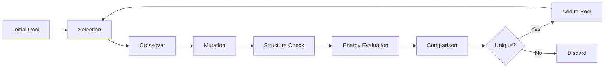

# GAtor

**A First-Principles Genetic Algorithm for Molecular Crystal Structure Prediction**

---

## What is GAtor?

GAtor is an open-source genetic algorithm (GA) for predicting the crystal structures of organic molecules. Given a molecular geometry as input, GAtor searches for the most stable packing arrangements in the solid state — a fundamental challenge in computational chemistry and materials science.

### Key Features

- **Multi-objective optimization** — Optimize energy, powder X-ray diffraction (PXRD) similarity, or combined fitness functions using the VC-PWDF metric
- **Machine-learned interatomic potentials (MLIPs)** — Native support for MACE, UMA, and AIMNet2 for fast GPU-accelerated energy evaluations
- **DFT backends** — Full support for FHI-aims and VASP for high-accuracy calculations
- **Cocrystal & Z' > 1 support** — Predict multi-component crystals and structures with multiple molecules in the asymmetric unit
- **Flexible molecules** — Conformer-aware crossover and mutation operators for molecules with torsional degrees of freedom
- **Adaptive selection** — Tournament selection with adaptive sizing, roulette wheel, and adaptive mixed strategies
- **Symmetry-aware crossover** — Preserves crystallographic symmetry during crossover operations
- **Clustering & duplicate detection** — Affinity propagation clustering with RCD or RSF feature vectors
- **Scalable parallelism** — Asynchronous parallel GA with `srun` or `mpirun` on HPC clusters

### How It Works

1. **Initial Pool** — Generate or load an initial set of crystal structures
2. **Selection** — Choose parent structures based on fitness (energy, PXRD similarity, etc.)
3. **Crossover** — Combine parent structures to create offspring
4. **Mutation** — Apply random perturbations (translation, rotation, strain, conformer changes)
5. **Structure Check** — Validate interatomic distances and cell geometry
6. **Energy Evaluation** — Relax and compute energy using MLIP or DFT
7. **Comparison** — Check for duplicates against the existing pool
8. **Pool Update** — Add unique, valid structures to the pool

---

## Quick Links

| | |
|---|---|
| [**Quick Start**](getting-started/quickstart.md) | Get running in 5 minutes |
| [**Installation**](getting-started/installation.md) | Full installation guide |
| [**Configuration**](user-guide/configuration.md) | Configure your GA run |
| [**Tutorials**](tutorials/index.md) | Step-by-step examples |
| [**Module Reference**](modules/index.md) | All GA operators explained |
| [**Config Reference**](reference/config-reference.md) | Every configuration option |

---

## Requirements

| Dependency | Version | Purpose |
|---|---|---|
| Python | >= 3.9 | Runtime |
| NumPy | >= 1.26.0 | Numerical operations |
| ASE | >= 3.22.0 | Atomic simulation environment |
| PyTorch | >= 2.4.0 | ML potential backends (optional) |
| pymatgen | >= 2024.1.1 | Structure analysis |
| mpi4py | any | MPI parallelization (optional) |
| SWIG | any | C extension compilation |

See the full [Installation Guide](getting-started/installation.md) for details.

---

## Citation

If you use GAtor in your research, please cite:

> F. Curtis, X. Li, T. Rose, A. Vazquez-Mayagoitia, S. Bhattacharya, L. M. Ghiringhelli, and N. Marom,
> "GAtor: A First-Principles Genetic Algorithm for Molecular Crystal Structure Prediction",
> *J. Chem. Theory Comput.*, 2018, DOI: [10.1021/acs.jctc.7b01152](https://doi.org/10.1021/acs.jctc.7b01152)
