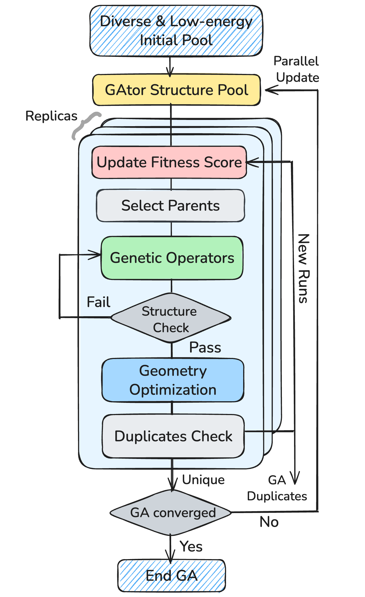

# Modules

GAtor's modular architecture allows you to swap implementations for each component of the genetic algorithm. Each module is selected via the `[modules]` section of the configuration file.

  

| Module | Purpose | Page |
|--------|---------|------|
| [Optimization](optimization.md) | Energy evaluation & relaxation | MACE, UMA, AIMNet2, FHI-aims, VASP |
| [Selection](selection.md) | Choose parents for breeding | Tournament, Roulette, Adaptive |
| [Crossover](crossover.md) | Combine parents into offspring | Symmetric, Standard, Torsion, Dimer |
| [Mutation](mutation.md) | Random perturbation of structures | Translation, Rotation, Strain, Conformer |
| [Fitness](fitness.md) | Evaluate structure quality | Energy, PXRD, Multi-objective |
| [Comparison](comparison.md) | Detect duplicate structures | pymatgen StructureMatcher |
| [Clustering](clustering.md) | Group similar structures | Affinity Propagation with RCD/RSF |
