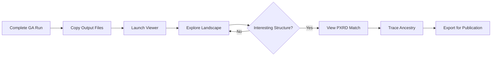

# Tutorial 7: CSP Landscape Viewer

GAtor includes an **interactive CSP landscape viewer** — a React-based web application for exploring crystal structure prediction results, comparing structures, and analyzing PXRD matches.

---

## Overview

The CSP Landscape Viewer (`examples/06_post_analysis/csp-viewer-v2.jsx`) provides:

- **Interactive energy landscape** — Scatter plots of ΔE vs density, colored by space group
- **Structure comparison** — Side-by-side comparison of predicted vs experimental structures
- **PXRD pattern overlay** — Simulated vs experimental PXRD patterns with similarity scores
- **Filtering and sorting** — Filter by energy, space group, PXRD similarity, or GA iteration
- **Ancestry visualization** — Trace the evolutionary history of any structure
- **Exportable figures** — Download publication-quality plots

## Prerequisites

To run the viewer, you need:

1. **Node.js** (v16+) and **npm** installed
2. A completed GAtor run with output in the `structures/` and `tmp/` directories
3. The `match/` folder (if performing PXRD-assisted runs)

## Setting Up the Viewer

### Step 1: Create a React Project

```bash
npx create-react-app csp-viewer
cd csp-viewer
```

### Step 2: Install Dependencies

The viewer uses several React libraries for visualization:

```bash
npm install recharts lucide-react
```

### Step 3: Add the Viewer Component

Copy the viewer component into your project:

```bash
cp /path/to/GAtor/examples/06_post_analysis/csp-viewer-v2.jsx \
    src/CSPViewer.jsx
```

### Step 4: Update `src/App.js`

```jsx
import CSPViewer from './CSPViewer';

function App() {
  return <CSPViewer />;
}

export default App;
```

### Step 5: Launch

```bash
npm start
```

The viewer opens at `http://localhost:3000`.

## Preparing Data for the Viewer

### From a GAtor Run

After a completed GAtor run, prepare the data:

```bash
# 1. Copy the energy hierarchy
cp tmp/energy_hierarchy_*.dat viewer_data/

# 2. Copy the match folder (if PXRD-assisted)
cp -r match/ viewer_data/

# 3. Copy experimental match records
cp tmp/exp_match_record.dat viewer_data/
```

### Data Format

The viewer reads the standard GAtor output files:

| File | Format | Content |
|---|---|---|
| `energy_hierarchy_*.dat` | Space-separated columns | Ranked structures with energy, volume, lattice params, SG |
| `exp_match_record.dat` | Tab-separated | GA step, match status, RMSD, energy |
| `match/*.cif` | CIF format | Matched structure files for 3D viewing |

## Using the Viewer

### Energy Landscape Tab

- **Scatter plot**: Each point is a crystal structure, plotted as ΔE vs density
- **Color coding**: Points colored by space group
- **Hover**: Shows structure ID, energy, volume, space group
- **Click**: Selects structure for detailed analysis
- **Zoom/pan**: Interactive zoom and pan controls

### PXRD Comparison Tab

- **Pattern overlay**: Simulated PXRD pattern of selected structure vs experimental
- **Similarity score**: VC-PWDF metric displayed (lower = better match)
- **Peak identification**: Major peaks labeled with Miller indices

### Structure Browser Tab

- **Sortable table**: All structures sortable by rank, energy, volume, SG
- **Filter controls**: Filter by energy range, space group, or GA iteration
- **Export**: Download selected structures as CIF files

### Ancestry Tab

- **Tree visualization**: Shows parent-child relationships
- **Operator annotations**: Which crossover/mutation produced each structure
- **Energy tracking**: Energy of each ancestor in the tree

## Workflow: From GA Run to Interactive Analysis



### Typical Analysis Session

1. **Overview**: Open the energy landscape to see the full structure distribution
2. **Identify candidates**: Look for low-energy structures in the correct space group
3. **PXRD validation**: For PXRD-assisted runs, check which structures match the experimental pattern
4. **Ancestry analysis**: For the best matches, trace back through the GA to understand how they were discovered
5. **Export**: Download the best structures as CIF files for further analysis

## Downloading Results for Offline Analysis

If running GAtor on an HPC cluster, download the results for local analysis:

```bash
# On the HPC cluster — package the results
cd /path/to/gator/run
tar czf gator_results.tar.gz \
    tmp/energy_hierarchy_*.dat \
    tmp/exp_match_record.dat \
    structures/ \
    match/

# On your local machine — download and extract
scp user@hpc:/path/to/gator_results.tar.gz .
tar xzf gator_results.tar.gz
```

Then point the viewer at the extracted data directory.

---

## Tips

!!! tip "Large Runs"
    For runs with thousands of structures, the viewer may be slow to load. Use the filter controls to narrow down to the most interesting subset.

!!! tip "Publication Figures"
    The Python scripts (`plt_convergence.py`, `plt_pool.py`) produce higher-resolution figures suitable for publications. Use the viewer for interactive exploration and the scripts for final figures.

!!! tip "Comparing Multiple Runs"
    Run the viewer separately for each GA run, or use `plt_convergence.py` with multiple `RUN_DIRS` to overlay convergence curves from different strategies.
