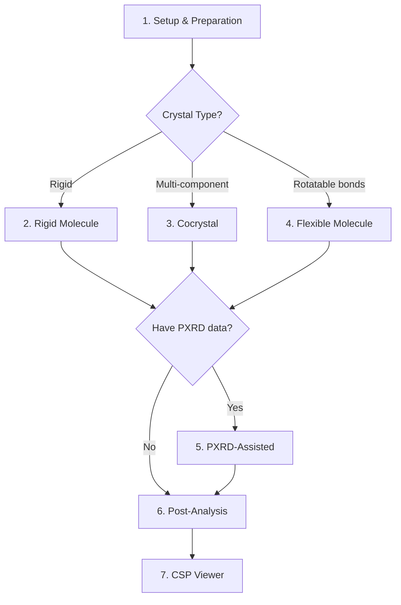

# Tutorials

Step-by-step guides for every stage of crystal structure prediction with GAtor.

## Tutorial Roadmap

| Tutorial | Description | Difficulty |
|----------|-------------|------------|
| [**1. Setup & Preparation**](setup.md) | HPC configuration, pool preparation, and SR analysis | Beginner |
| [**2. Rigid Molecule with MLIP**](rigid-mlip.md) | Predict crystal structures for Uracil using UMA or FHI-aims | Beginner |
| [**3. Cocrystal Prediction**](cocrystal.md) | Multi-component crystal prediction for BEDQAG | Intermediate |
| [**4. Flexible Molecule**](flexible.md) | Handle conformational flexibility for UJIRIO | Intermediate |
| [**5. PXRD-Assisted Search**](pxrd-assisted.md) | Use experimental PXRD data to guide the search | Advanced |
| [**6. Post-Analysis**](post-analysis.md) | Convergence plots, structure extraction, and visualization | Beginner |
| [**7. CSP Landscape Viewer**](csp-viewer.md) | Interactive analysis of prediction results | Advanced |

---

## Before You Begin

All tutorials assume:

1. GAtor is [installed](../getting-started/installation.md) and the `gator` Conda environment is activated
2. You have access to a GPU node (for MLIP runs) or CPU nodes (for DFT runs)

## Example Files

Complete, ready-to-use input files are provided in the GAtor repository under `examples/`:

```
examples/
├── 00_setup/                         # HPC & calculator configuration
│   ├── ui_template.conf              # Full ui.conf template with all options
│   ├── calculator.conf               # Calculator-specific settings reference
│   ├── setup_runs.py                 # Create multiple comparative runs
│   ├── submit_gpu.sh                 # GPU submit script (MLIP)
│   ├── submit_cpu.sh                 # CPU submit script (DFT)
│   └── DFT_settings/                 # FHI-aims and VASP settings
├── 01_prepare/                       # Structure preparation & pool analysis
│   ├── prepare_structures.py         # CIF/POSCAR/Genarris → structures.json
│   ├── analyze_pool.py               # Pool analysis (SR, energy, volume, SG)
│   └── recommend_sr.py               # Auto-recommend SR from analysis
├── 02_quick_start/                   # Uracil (rigid molecule)
│   └── Uracil/
│       ├── MLIP/                     # UMA on GPU (fast, recommended)
│       │   ├── ui.conf, submit.sh, structures.json, 1278441.cif
│       └── DFT/                      # FHI-aims on CPU
│           ├── ui.conf, submit.sh, mol.in, aims.json, structures.json
├── 03_cocrystal/                     # Binary cocrystal (BEDQAG)
│   └── BEDQAG/
│       ├── ui.conf, structures.json, 2123841.cif, mol_1.in, mol_2.in
├── 04_flexible/                      # Flexible molecule (UJIRIO)
│   └── UJIRIO/
│       ├── ui.conf, submit.sh, structures.json, conformers.json
├── 05_pxrd_assisted/                 # PXRD-guided GA
│   ├── Uracil/                       # PXRD-assisted run
│   │   ├── ui.conf, structures.json, uracil-lqlt.xy, 1278441.cif
│   └── fine-tune/                    # Post-GA PXRD refinement
│       ├── ui.conf, uracil-lqlt.xy, initial_pool/
└── 06_post_analysis/                 # Results analysis & visualization
    ├── plt_convergence.py            # GA convergence plots
    ├── plt_pool.py                   # Structure landscape plots
    ├── extract_low.py                # Extract low-energy structures
    ├── extract_tree.py               # Extract GA ancestry trees
    └── csp-viewer-v2.jsx             # Interactive structure viewer (React)
```

Each example directory includes a `README.md` with a step-by-step walkthrough. The tutorials in this documentation expand on those READMEs with additional context and best practices.

---

## Suggested Learning Path


