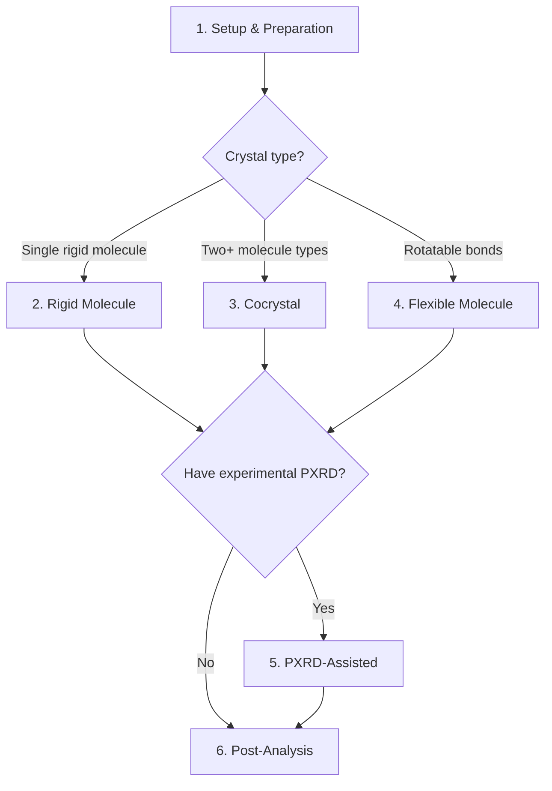

# Tutorials

Step-by-step guides for every stage of crystal structure prediction with GAtor.

## Pick Your Tutorial

| # | Tutorial | What You'll Learn | Difficulty |
|---|----------|-------------------|------------|
| 1 | [**Setup & Preparation**](setup.md) | Choose a calculator, prepare structures, determine SR | Beginner |
| 2 | [**Rigid Molecule**](rigid-mlip.md) | Run Uracil CSP with UMA (GPU) or FHI-aims (CPU) | Beginner |
| 3 | [**Cocrystal**](cocrystal.md) | Predict BEDQAG — a 1:1 binary cocrystal | Intermediate |
| 4 | [**Flexible Molecule**](flexible.md) | Handle UJIRIO — conformers + torsion angle blending | Intermediate |
| 5 | [**PXRD-Assisted**](pxrd-assisted.md) | Guide the GA with experimental PXRD data + fine-tuning | Advanced |
| 6 | [**Post-Analysis**](post-analysis.md) | Convergence plots, energy landscapes, structure extraction | Beginner |
| 7 | [**CSP Landscape Viewer**](csp-viewer.md) | Interactive web-based analysis of results | Advanced |

---

## Which Tutorial Do I Need?

## Prerequisites

All tutorials assume GAtor is [installed](../getting-started/installation.md) and you have access to a GPU or CPU node.

Every tutorial has a **ready-to-run example** in the `examples/` directory — you can copy it, edit 2–3 lines, and submit.

| Tutorial | Example Directory |
|---|---|
| Setup | `examples/00_setup/` + `examples/01_prepare/` |
| Rigid | `examples/02_quick_start/Uracil/` |
| Cocrystal | `examples/03_cocrystal/BEDQAG/` |
| Flexible | `examples/04_flexible/UJIRIO/` |
| PXRD-Assisted | `examples/05_pxrd_assisted/Uracil/` |
| Post-Analysis | `examples/06_post_analysis/` |
