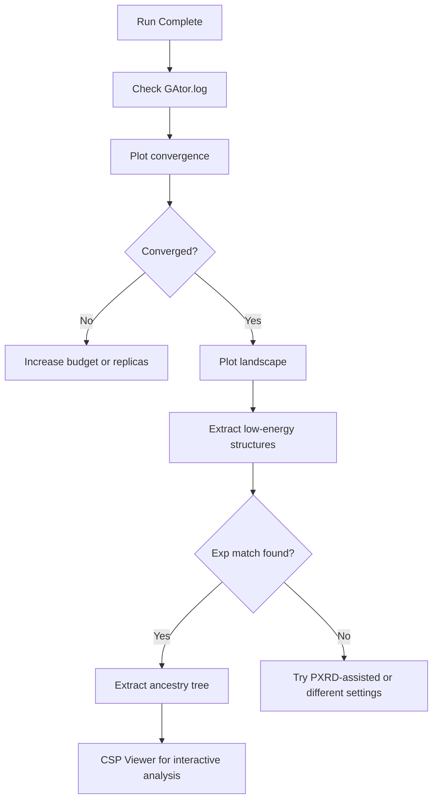

# Tutorial 6: Post-Analysis

Analyze GAtor results with convergence plots, energy landscapes, structure extraction, and ancestry analysis.

All scripts are in `examples/06_post_analysis/`.

---

## Output Files

After a run completes:

| File | Location | Content |
|---|---|---|
| `energy_hierarchy_*.dat` | `tmp/` | All structures ranked by energy |
| `exp_match_record.dat` | `tmp/` | Experimental match tracking per GA step |
| `xtal_fitness.json` | `tmp/` | Fitness values per structure |
| `GAtor.log` | Working dir | Main run log |

### Reading `energy_hierarchy_*.dat`

```
# Rank  Added  Replica  Index         Energy     Volume   a      b      c      alpha  beta   gamma  SG
  1     45     rep_0    a1b2c3d4e5    -234.567   750.2    7.12   9.40   11.75  90.0   97.5   90.0   14
  2     0      init     f6g7h8i9j0    -234.123   748.8    7.10   9.38   11.70  90.0   97.3   90.0   14
```

- **`Added = 0`** → initial pool; **`Added > 0`** → GA-generated (in order of generation)

Energy conversion to kJ/mol/molecule:

$$\Delta E \text{ [kJ/mol/molecule]} = \frac{E_{\text{eV}} - E_{\text{ref}}}{0.010364 \times N_{\text{molecules/cell}}}$$

---

## 1. Convergence Plots

Edit the top of `plt_convergence.py`:

```python
BASE_DIR = Path("/path/to/your/gator/runs")
RUN_DIRS = ["energy_0.25", "energy_0.75"]   # Sub-directories to plot
NMPC = 4                                     # Molecules per unit cell
```

```bash
python examples/06_post_analysis/plt_convergence.py
```

**Output:** `GA_convergence.png` — three panels showing minimum energy, top-10 mean, and Boltzmann-weighted mean vs GA iteration. Experimental matches appear as star markers.

| Pattern | Meaning | Action |
|---|---|---|
| Both curves plateau | GA has converged | Run complete |
| Top-10 mean still decreasing | GA still improving | Increase `end_ga_structures_added` |
| Min drops but top-10 flat | Few good structures found | Check SR, increase replicas |

---

## 2. Structure Landscape Plots

Edit the top of `plt_pool.py`:

```python
BASE_DIR = Path("/path/to/your/gator/runs")
RUN_DIRS = ["energy_0.25", "energy_0.75"]
STOIC = "C:4_H:4_N:2_O:2"                   # From energy_hierarchy filename
NMPC = 4
CELL_MASS = 448.32                           # Sum of atomic masses × Z
EXP_CIF_PATH = Path("/path/to/experimental.cif")
```

```bash
python examples/06_post_analysis/plt_pool.py
```

**Output:** Three figures comparing initial pool (IP) and current pool (CP):

- `volume_plot.png` — Volume histogram with KDE overlay
- `lattice_plot.png` — 3D lattice parameter scatter colored by ΔE
- `landscape_plot.png` — ΔE vs density colored by space group

---

## 3. Extract Low-Energy Structures

Extract GA-generated structures that improved the pool:

```bash
python examples/06_post_analysis/extract_low.py \
    --run-dir /path/to/gator/run \
    --output-dir extracted/

# For multiple comparative runs:
python examples/06_post_analysis/extract_low.py \
    --run-dir /path/to/runs \
    --sub-runs energy_0.25 energy_0.75 \
    --output-dir extracted/
```

---

## 4. Extract Ancestry Trees

Trace the evolutionary history of a specific structure:

```bash
python examples/06_post_analysis/extract_tree.py
```

Edit the script to set `dir_path` (structures directory) and `match_str` (target structure ID). The output shows parent-child relationships, crossover/mutation operators used, and energy at each generation.

---

## 5. Quick Commands

```bash
head -20 tmp/energy_hierarchy_*.dat                          # Top structures
awk '$2 > 0' tmp/energy_hierarchy_*.dat | head -20           # GA improvements only
cat tmp/exp_match_record.dat                                 # Experimental matches
awk '{print $13}' tmp/energy_hierarchy_*.dat | sort | uniq -c | sort -rn  # Space groups
```

---

## Recommended Workflow



---

## Tips

!!! tip "Multiple Independent Runs"
    Compare convergence across 2–3 runs with different fitness settings to assess robustness.

!!! tip "Convergence Indicator"
    The top-10 mean energy is the best convergence indicator. If still decreasing at the end of the run, increase `end_ga_structures_added`.

---

## Next Steps

- [Tutorial 7: CSP Landscape Viewer](csp-viewer.md) — Interactive visualization
