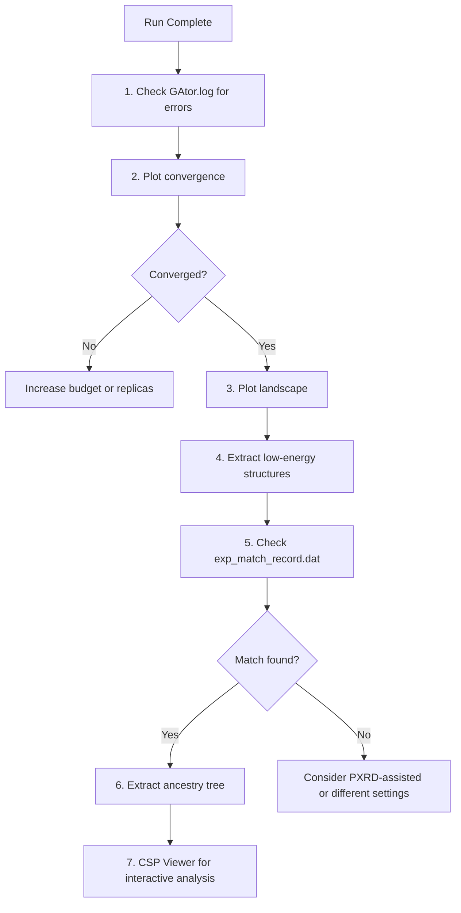

# Tutorial 6: Post-Analysis

This tutorial covers how to analyze and visualize results after a GAtor run completes — convergence tracking, energy landscapes, structure extraction, and ancestry analysis.

---

## Overview

After a GAtor run, several analysis scripts are available in `examples/06_post_analysis/`:

```
06_post_analysis/
├── plt_convergence.py       # GA convergence plots
├── plt_pool.py              # Structure landscape (E vs density, volume, lattice)
├── extract_low.py           # Extract low-energy structures
├── extract_tree.py          # Extract GA ancestry trees
└── csp-viewer-v2.jsx        # Interactive structure viewer (see Tutorial 7)
```

## Output Files

After a run completes, key output files are:

| File | Location | Content |
|---|---|---|
| `energy_hierarchy_*.dat` | `tmp/` | All structures ranked by energy |
| `exp_match_record.dat` | `tmp/` | Experimental match tracking per GA step |
| `xtal_fitness.json` | `tmp/` | Fitness values per structure |
| Structure directories | `structures/` | Full structure details + metadata |
| `GAtor.log` | Working dir | Main run log |

### Understanding `energy_hierarchy_*.dat`

```
# Rank  Added  Replica  Index         Energy     Volume   a      b      c      alpha  beta   gamma  SG
  1     45     rep_0    a1b2c3d4e5    -234.567   750.2    7.12   9.40   11.75  90.0   97.5   90.0   14
  2     0      init     f6g7h8i9j0    -234.123   748.8    7.10   9.38   11.70  90.0   97.3   90.0   14
```

- **`Added = 0`** → initial pool structure
- **`Added > 0`** → GA-generated (sequence number, in order of generation)
- **`Rank`** → position in energy ranking (1 = lowest energy)

### Energy Conversion

To convert from eV to kJ/mol/molecule:

$$\Delta E \text{ [kJ/mol/molecule]} = \frac{E_{\text{eV}} - E_{\text{ref}}}{0.010364 \times N_{\text{molecules/cell}}}$$

---

## 1. Convergence Plots

Generate publication-quality convergence plots showing the running minimum energy and top-10 mean energy vs. GA iteration.

### Setup

Edit the Configuration section at the top of `plt_convergence.py`:

```python
# Base directory containing the run sub-directories
BASE_DIR = Path("/path/to/your/gator/runs")

# Sub-directories to plot (each is a separate GA run)
# For a single run: RUN_DIRS = ["."]
RUN_DIRS = ["energy_0.25", "energy_0.75", "niching_0.25", "niching_0.75"]

# Molecules per unit cell (for eV → kJ/mol/molecule conversion)
NMPC = 4
```

### Run

```bash
python examples/06_post_analysis/plt_convergence.py
```

### Output

- **`GA_convergence.png`** — Three panels:
    1. **Minimum energy** vs GA iteration — should decrease and plateau
    2. **Top-10 mean energy** — should stabilize when the GA has converged
    3. **Top-N% Boltzmann-weighted mean** — weighted average favoring the best structures

Experimental matches (if tracked) are shown as star markers on the curves.

### Interpreting Convergence

| Pattern | Meaning | Action |
|---|---|---|
| Min energy plateaus early | GA found minimum quickly | Increase diversity or restart |
| Top-10 mean still decreasing | GA still improving | Increase `end_ga_structures_added` |
| Both plateau | GA has converged | Run complete |
| Min drops but top-10 flat | Few good structures found | Check SR, increase replicas |

---

## 2. Structure Landscape Plots

Generate three figures comparing the initial pool (IP) and current pool (CP):

### Setup

Edit the Configuration section at the top of `plt_pool.py`:

```python
BASE_DIR = Path("/path/to/your/gator/runs")
RUN_DIRS = ["energy_0.25", "energy_0.75", "niching_0.25", "niching_0.75"]

# Stoichiometry string from energy_hierarchy filename
STOIC = "C:4_H:4_N:2_O:2"    # e.g., for Uracil

# Molecules per unit cell
NMPC = 4

# Molecular mass per cell (sum of atomic masses × Z)
CELL_MASS = 448.32            # e.g., Uracil: 112.08 × 4

# Path to experimental CIF file (for reference markers)
EXP_CIF_PATH = Path("/path/to/experimental.cif")
```

### Run

```bash
python examples/06_post_analysis/plt_pool.py
```

### Output

- **`volume_plot.png`** — Unit-cell volume histogram with KDE overlay (IP vs CP)
- **`lattice_plot.png`** — 3D lattice parameter scatter (a, b, c) colored by ΔE
- **`landscape_plot.png`** — Crystal energy landscape: ΔE vs density, colored by space group

The experimental structure is marked as a red star in all plots.

---

## 3. Extract Low-Energy Structures

Extract GA-generated structures that improved the pool (lower energy than the initial pool minimum) along with their full ancestry trees:

```bash
python examples/06_post_analysis/extract_low.py \
    --run-dir /path/to/gator/run \
    --output-dir extracted/
```

For multiple comparative runs:

```bash
python examples/06_post_analysis/extract_low.py \
    --run-dir /path/to/runs \
    --sub-runs energy_0.25 energy_0.75 \
    --output-dir extracted/
```

### Output

Extracted structures are organized by run, with each structure's directory containing:

- Structure JSON files with all properties
- Parent structure links (for ancestry tracing)

---

## 4. Extract GA Ancestry Trees

Trace the evolutionary history of a specific structure — who were its parents, grandparents, etc.:

```bash
python examples/06_post_analysis/extract_tree.py
```

!!! note "Configuration Required"
    Edit the script to set the `dir_path` (structures directory) and `match_str` (target structure ID).

### What the Ancestry Shows

Each structure stores its genetic history:

- `parent_0` — First parent (from selection)
- `parent_1` — Second parent (from crossover, if applicable)
- `crossover_type` — Which crossover operator was used
- `mutation_type` — Which mutation operator was applied

The extracted tree creates nested directories:

```
target_structure/
├── structure.json         # The target structure
├── parent_0/              # First parent
│   ├── structure.json
│   └── parent_0/          # Grandparent
│       └── ...
└── parent_1/              # Second parent (if crossover)
    └── ...
```

---

## 5. Quick Analysis Commands

### View top structures

```bash
head -20 tmp/energy_hierarchy_*.dat
```

### Count GA improvements

```bash
# Count structures added by GA (Added > 0) that appear in top-N
awk '$2 > 0' tmp/energy_hierarchy_*.dat | head -20
```

### Check for experimental matches

```bash
grep "match" GAtor.log
cat tmp/exp_match_record.dat
```

### Space group distribution

```bash
awk '{print $13}' tmp/energy_hierarchy_*.dat | sort | uniq -c | sort -rn
```

---

## Recommended Analysis Workflow



---

## Tips

!!! tip "Run 2–3 Independent GA Runs"
    Compare convergence across runs with different fitness settings (energy vs niching) and crossover probabilities to assess robustness.

!!! tip "Top-10 Mean Plateau"
    The top-10 mean energy is the best indicator of convergence. If it's still decreasing at the end of the run, increase `end_ga_structures_added`.

!!! tip "Experimental Match Record"
    Check `tmp/exp_match_record.dat` for experimental structure matches. Each line shows whether a GA-generated structure matches the experimental crystal (`Matches_Exp = True`).

---

## Next Steps

- [Tutorial 7: CSP Landscape Viewer](csp-viewer.md) — Interactive visualization and analysis
