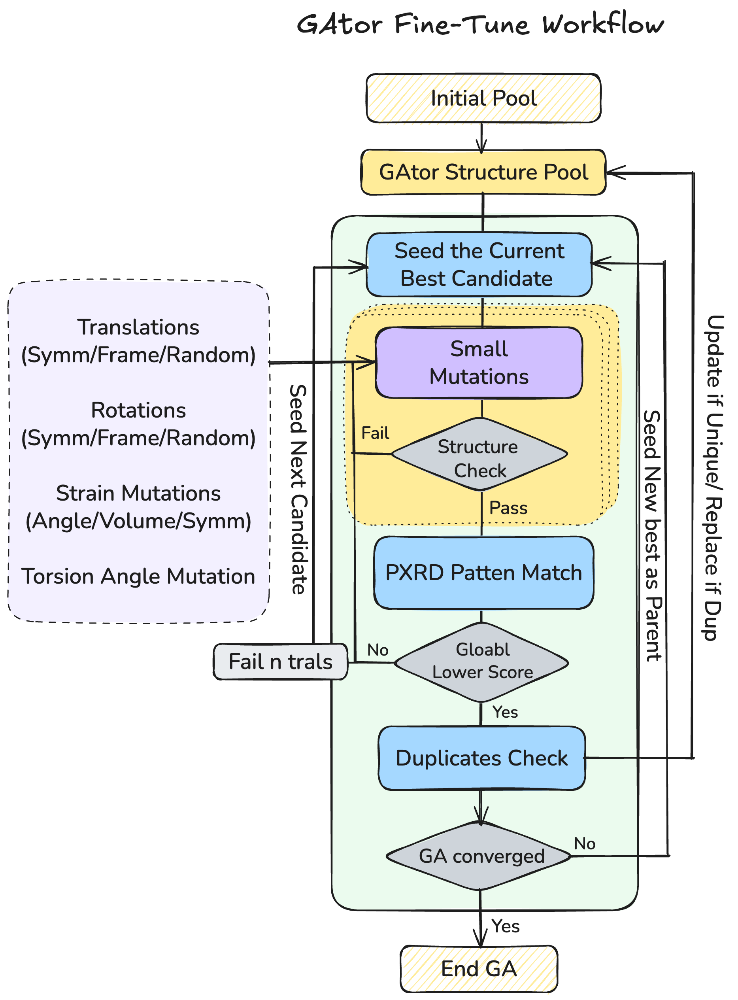

# Tutorial 5: PXRD-Assisted Search

Guide the crystal structure prediction with experimental powder X-ray diffraction (PXRD) data using a combined energy + PXRD fitness function, followed by optional fine-tuning.

!!! info "Prerequisites"
    - Read [Tutorial 2](rigid-mlip.md) first — this tutorial shows only the settings that differ from the baseline configuration.
    - [critic2](https://aoterodelaroza.github.io/critic2/) must be installed and on PATH (`which critic2`).
    - Experimental PXRD pattern (`.xy` file: two-column, 2θ vs intensity).

---

## Quick Start

The ready-to-run example is in `examples/05_pxrd_assisted/Uracil/`:

1. **Copy the example**:

    ```bash
    cp -r examples/05_pxrd_assisted/Uracil my_pxrd_run
    cd my_pxrd_run
    ```

2. **Edit `ui.conf`** — update `exp_path`, `pxrd_file`, and `pxrd_cell`

3. **Edit `submit.sh`** — set your allocation and activate the environment

4. **Submit**: `sbatch submit.sh`

---

## How It Works

The fitness function blends energy and PXRD similarity:

$$F = (1 - \lambda) \cdot F_{\text{energy}} + \lambda \cdot F_{\text{PXRD}}$$

where λ is `pxrd_scaling_factor`. Higher λ = stronger bias toward matching the experimental PXRD pattern.

| λ Value | Behavior |
|---|---|
| `0.00` | Pure energy (baseline comparison) |
| `0.10–0.50` | Gentle to balanced guidance |
| **`0.90`** | **Strong PXRD bias (recommended)** |
| `1.00` | Pure PXRD (not recommended) |

### PXRD File Format

Two-column `.xy` file (no header, whitespace-separated): column 1 = 2θ (degrees), column 2 = intensity.

---

## Configuration Changes

Starting from the [baseline config](rigid-mlip.md#configuration-reference), change these sections:

```ini
[modules]
# ... (same as baseline, except:)
fitness_module = vc_energy_fitness           # Enables PXRD-guided multi-objective fitness

[fitness]
energy_name = energy
pxrd_file = uracil-lqlt.xy                  # Path to experimental PXRD pattern
pxrd_cell = 3.6691 10.3146 12.3958 90 90 96.637   # Experimental cell: a b c α β γ
pxrd_scaling_factor = 0.90                   # Weight of PXRD similarity (0–1)

[initial_pool]
# ... (same as baseline, plus:)
stored_pwdf_name = vc_similarity             # Store PXRD similarity scores

[UMA]
store_energy_names = uma uma_lbfgs
relative_energy_thresholds = 1000 1000       # Both generous — fitness depends on PXRD, not just energy
reject_if_worst_energy = FALSE FALSE
fmax = 0.01
steps = 1500

[crossover]
crossover_probability = 0.75
```

!!! important "Energy Thresholds"
    Both `relative_energy_thresholds` are set to `1000` because the fitness function depends on PXRD similarity, not just energy. Tight thresholds would reject structures that match the PXRD but are not energy minima.

### Combining with Other Crystal Types

PXRD guidance is an overlay — add the `[fitness]` settings above to any crystal type (rigid, flexible, cocrystal).

---

## Post-GA Fine-Tuning

<p align="center">
  
</p>

After the GA, refine the best candidates against the experimental PXRD pattern using small local mutations. The fine-tune mode iteratively:

1. Selects the best-matching structure
2. Generates small mutations (translations, rotations, strains)
3. Evaluates VC-PWDF in parallel
4. Keeps improvements until convergence

### Fine-Tune Configuration

The example is in `examples/05_pxrd_assisted/fine-tune/`:

```ini
[GAtor_master]
fill_initial_pool = FALSE
run_ga = FALSE
fine_tune = TRUE                             # Enable fine-tune mode

[fitness]
energy_name = energy
pxrd_file = uracil-lqlt.xy
pxrd_cell = 3.6691 10.3146 12.3958 90 90 96.637

[initial_pool]
user_structures_dir = ./initial_pool         # Candidate structures from GA
stored_energy_name = uma_lbfgs
stored_vc_name = vc_similarity
prepare_initial_pool = FALSE

[parallel_settings]
parallelization_method = serial              # Fine-tune uses multiprocessing, not MPI

[fine_tune]
num_processes = 128                          # CPU processes for parallel PXRD
num_trial = 100                              # Mutation trials per generation
num_ga_structures = 20
max_generations = 1000
max_no_improvement = 20                      # Stop after N generations without improvement
vc_improvement_threshold = 0.01

[mutation]
# Small perturbations for local refinement
stand_dev_trans = 0.05
stand_dev_rot = 5
stand_dev_strain = 0.05
stand_dev_cell_angle = 2.0
torsion_sigma = 5.0
```

### Running Fine-Tune

```bash
# Copy candidate structures from GA output to initial_pool/
python examples/01_prepare/prepare_structures.py /path/to/ga_output_cifs \
    --output structures.json

# Run (CPU only, no GPU needed)
run_gator ui.conf
```

### Interpreting Results

Output files are named with their PWDF score:

```
best_pwdf_0.031637_struct_04dbd973f5.cif
best_pwdf_0.045123_struct_a1b2c3d4e5.cif
```

Lower PWDF = better match. Values below **0.05** indicate very good agreement with the experimental pattern.

---

## Tips

!!! tip "Thread Control"
    Set `OMP_NUM_THREADS=1` to avoid thread conflicts between MLIP and critic2.

!!! tip "Two-Stage Workflow"
    For best results: (1) energy-only GA to establish the landscape, (2) PXRD-assisted GA for refinement, (3) fine-tune for final local optimization.

!!! tip "PXRD Pattern Quality"
    Ensure your `.xy` file covers sufficient 2θ range (typically 5–50°) with good signal-to-noise ratio.

---

## Next Steps

- [Tutorial 6: Post-Analysis](post-analysis.md) — Convergence plots and structure extraction
- [Tutorial 7: CSP Landscape Viewer](csp-viewer.md) — Interactive analysis
