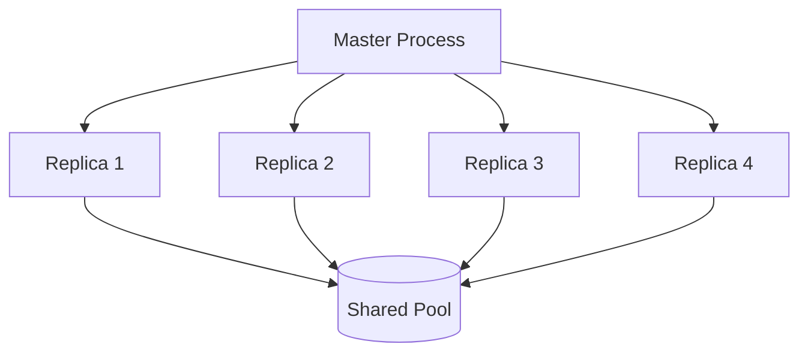

# Parallelization

GAtor uses an asynchronous parallel architecture where multiple **replicas** independently run the GA loop, sharing a common structure pool through the filesystem.

---

## Architecture



Each replica:

1. Reads the current pool
2. Selects parents
3. Performs crossover and mutation
4. Evaluates energy
5. Checks for duplicates
6. Writes new structures to the shared pool

---

## Configuration

### `[parallel_settings]`

| Option | Type | Description |
|--------|------|-------------|
| `parallelization_method` | string | `srun`, `mpirun`, or `serial` |
| `run_on_gpu` | bool | Enable GPU for MLIP calculations |
| `replicas_per_node` | int | Number of GA replicas per node |
| `processes_per_replica` | int | CPU processes per replica |
| `cpus_per_replica` | int | CPUs allocated per replica (SLURM) |
| `nodes_per_replica` | float | Nodes per replica (can be < 1) |
| `python_command` | string | Python executable name |
| `aims_processes_per_replica` | int | MPI ranks for FHI-aims per replica |
| `srun_memory_per_core` | int | Memory per core in MB (srun) |
| `srun_gator_memory` | int | Memory for GAtor process in MB (srun) |

---

## Common Setups

### GPU with MLIP (MACE / UMA / AIMNet2)

For GPU-accelerated ML potential runs, each replica uses one GPU:

```ini
[parallel_settings]
parallelization_method = srun
run_on_gpu = TRUE
replicas_per_node = 4        # 4 GPUs per node = 4 replicas
processes_per_replica = 1     # 1 CPU process per replica
python_command = python
```

**SLURM script:**

```bash
#!/bin/bash
#SBATCH -N 1
#SBATCH --time=04:00:00
#SBATCH -C gpu
#SBATCH --gpus-per-node=4
#SBATCH -q regular
#SBATCH -A your_account

conda activate gator
python /path/to/GAtor/gator/GAtor_master.py ui.conf
```

### Multi-Node DFT (FHI-aims)

For DFT calculations, each replica controls one FHI-aims job:

```ini
[parallel_settings]
parallelization_method = srun
replicas_per_node = 1
processes_per_replica = 1
aims_processes_per_replica = 128
python_command = python

[FHI-aims]
execute_command = srun
path_to_aims_executable = /path/to/aims.x
control_in_directory = control
control_in_filelist = control.in.SPE control.in.FULL
```

**SLURM script:**

```bash
#!/bin/bash
#SBATCH -N 8
#SBATCH --time=24:00:00
#SBATCH --ntasks-per-node=128
#SBATCH -q regular
#SBATCH -A your_account

module load cray-mpich
conda activate gator
python /path/to/GAtor/gator/GAtor_master.py ui.conf
```

### Serial (Single Process)

For testing or debugging:

```ini
[parallel_settings]
parallelization_method = serial
```

---

## Scaling Guidelines

| System | Nodes | Replicas/Node | Total Replicas | Use Case |
|--------|-------|---------------|----------------|----------|
| 1 GPU node | 1 | 4 | 4 | Quick MLIP test |
| 4 GPU nodes | 4 | 4 | 16 | Production MLIP |
| 8 CPU nodes | 8 | 1 | 8 | FHI-aims production |
| 32 CPU nodes | 32 | 1 | 32 | Large-scale DFT |

!!! tip "Optimal Replica Count"
    More replicas = more diversity in the search. For MLIP runs, 8-16 replicas is a good starting point. For DFT, 4-8 replicas is typical due to the higher cost per evaluation.
